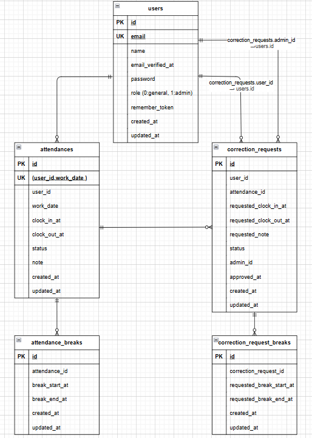

## アプリケーション名
coachtech-attendance

## サービス概要
ある企業が開発した独自の勤怠管理アプリ

## 制作の目的
ユーザーの勤怠と管理を目的とする

## ターゲットユーザー
社会人全般

## 対応環境
PC（Chrome / Firefox / Safari の最新バージョン）

---

## 環境構築

### 1. リポジトリをクローン
```bash
git clone git@github.com:ayano-0819/coachtech-attendance.git
```

### 2. プロジェクトに移動
```bash
cd coachtech-attendance
```

### 3. Dockerコンテナをビルド
```bash
docker compose up -d --build
```

### 4. PHPコンテナにログインする
```bash
docker compose exec php bash
```

### 5. Laravelのパッケージをインストール
```bash
composer install
```

### 6. .envファイルを作成
```bash
cp .env.example .env
```

### 7. アプリケーションキーを生成する
```bash
php artisan key:generate
```

### 8. .envファイルを修正
6で作成された「.env 」を以下のように修正する。
```env
DB_CONNECTION=mysql
DB_HOST=mysql
DB_PORT=3306
DB_DATABASE=laravel_db
DB_USERNAME=laravel_user
DB_PASSWORD=laravel_pass

MAIL_MAILER=smtp
MAIL_HOST=sandbox.smtp.mailtrap.io
MAIL_PORT=2525
MAIL_USERNAME=
MAIL_PASSWORD=
MAIL_ENCRYPTION=tls
MAIL_FROM_ADDRESS="no-reply@example.com"
MAIL_FROM_NAME="${APP_NAME}"

```

※MAIL_USERNAME と MAIL_PASSWORDは各自の環境に合わせて設定する。<br>

### 9. マイグレーション実行
```bash
php artisan migrate
```

### 10. シーディング実行
```bash
php artisan db:seed
```

---

## 使用技術
- PHP 8.1.34
- Laravel 8.x
- Laravel Fortify
- MySQL 8.0
- Nginx 1.21
- Docker 28.4.0
- Mailtrap（メール認証確認用）

---

## URL
- アプリ: http://localhost
- phpMyAdmin: http://localhost:8080

---

## ログイン情報

### 一般ユーザー（シーディングデータ）
- メールアドレス: test1@example.com
- パスワード: password

- メールアドレス: test2@example.com
- パスワード: password

- メールアドレス: test3@example.com
- パスワード: password

---

## メール認証について
本アプリでは Laravel Fortify を用いてメール認証機能を実装している。  
会員登録後、認証メールが送信され、メール内の認証リンクをクリックすることで認証が完了する。  

開発環境では Mailtrap を使用して認証メールを確認する。  

また、未認証ユーザーが認証必須ページへアクセスした場合は、メール認証誘導画面へリダイレクトされる。

---

## ER図

